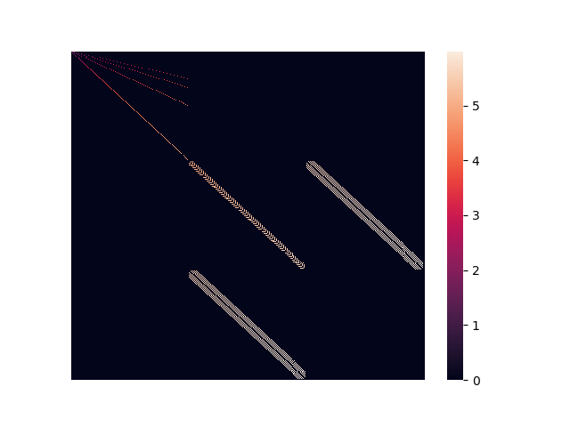

# SpMV_benchmark
A benchmark of sparse matrix dense vector multiplication in C++ using homebuilt and pre-packaged methods.

### Dependencies
- CMake
- MPI Compiler
- OpenMP
- Eigen
- Cyclops Tensor Framework
- TiledArray

### Building
```bash
mkdir build
cd build
cmake ..
make
```
__Note: The Eigen test may generate a few warnings.__:

### Running the tests
To run all the tests at once you can use the bash script provided in the main repo directory.
```bash
cd /path/to/SpMV_benchmark
./run_all_tests.sh
```

To change the size of the problem (the dimension of the matrix) you can change the `N` variable in `run_all_tests.sh`.

If you want to run the tests individually you can run them from the command line with a single __integer__ argument that specifies the size of the matrix.
Ex.

Input:
```bash
./native 100000000
```
Output:
```
Homemade sparse Matrix Mult. Time 1666 (milliseconds) for matrix of size 100000000 x 100000000
```

A 400x400 version of the sparse matrix:


### Brief Results Summary (WIP)
Results from:
```
       OS:    macOS Mojave Version 10.14.3
 Computer:    MacBook Pro (Retina, 15-inch, Mid 2015)
Processor:    2.2 GHz Intel Core i7
   Memory:    16 GB 1600 MHz DDR3
```

__As the tests become more refined these tests will be done on RMACC Summit/Blanca cluster__.

```
OMP_NUM_THREADS=1
Homemade matrix population time 7488 (milliseconds) for matrix of size 20000000 x 20000000
Homemade sparse matrix mult. time 1382 (milliseconds) for matrix of size 20000000 x 20000000
Eigen matrix population time 11814 (milliseconds) for matrix of size 20000000 x 20000000
Eigen sparse matrix mult. time 397 (milliseconds) for matrix of size 20000000 x 20000000
```

```
OMP_NUM_THREADS=4
Homemade matrix population time 6498 (milliseconds) for matrix of size 20000000 x 20000000
Homemade sparse matrix mult. time 425 (milliseconds) for matrix of size 20000000 x 20000000
Eigen matrix population time 11021 (milliseconds) for matrix of size 20000000 x 20000000
Eigen sparse matrix mult. time 419 (milliseconds) for matrix of size 20000000 x 20000000
```

```
OMP_NUM_THREADS=8
Homemade matrix population time 6597 (milliseconds) for matrix of size 20000000 x 20000000
Homemade sparse matrix mult. time 384 (milliseconds) for matrix of size 20000000 x 20000000
Eigen matrix population time 11073 (milliseconds) for matrix of size 20000000 x 20000000
Eigen sparse matrix mult. time 367 (milliseconds) for matrix of size 20000000 x 20000000
```
